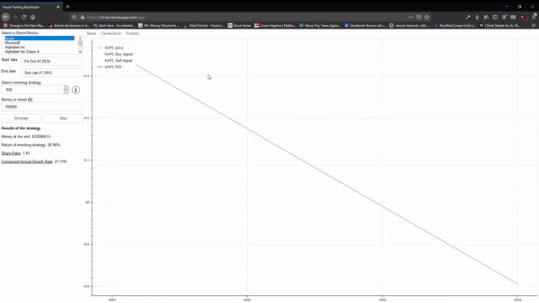
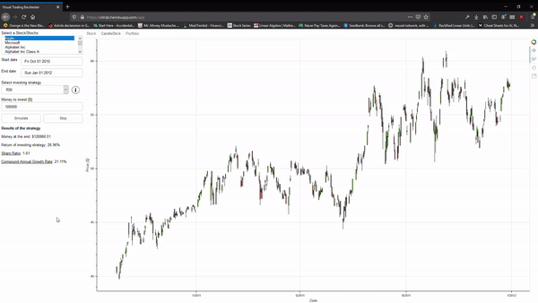

# VITRAB - Visual Trading Backtester
This a bokeh platform where you can visualize different trading strategies, on different historical data.

## Fun facts
* You can visualize ohlc (open-high-low-close) data as everyone with candles
* You can read about the used indicators, by clicking thi (i) button next to "select investing strategy" dropdown
* You can see how the portfolios value change by time, on the third tab

## Built With
* [Python](https://www.python.org/)
* [Bokeh](https://bokeh.org/) - Visualization library
* [pandas_datareader](https://pandas-datareader.readthedocs.io/en/latest/) - remote data access for panda

## Authors

* **Kardos Tamás** - [Swordy](https://github.com/swordey)